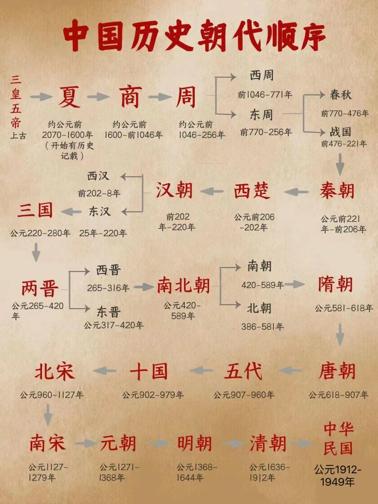
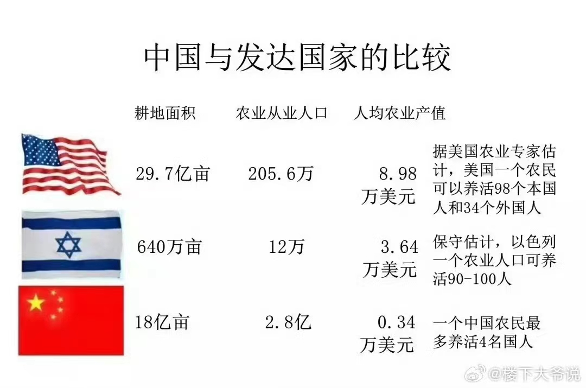

中国历史朝代顺序一必须收藏

三皇五帝始，尧舜禹相传。

夏商与西周，东周分两段。

春秋与战国，一统秦两汉。

三分魏蜀吴，两晋前后延。

南北朝并立，隋唐五代传。

宋元明清后，皇朝自此完。

夏：约公元前2070-前1600年【共471年】  
夏禹定都阳城、阳翟、斟鄩、商丘、平阳今河南郑州、许昌、洛阳、商丘、安邑

商：约公元前1600年-前1046年【共554年】  
商汤定都毫、西毫、嚣、相、邢、殷、朝歌今河南商丘、洛阳、郑州、安阳、焦作、鹤壁、河北邢台

西周：前1046-前771年【共275年】周武王姬发定都镐京、成周今陕西西安、河南洛阳

东周（分为春秋与战国）：

春秋：前770-前476年 周平王姬宜白定都洛邑五霸：秦穆公/晋文公/齐桓公/宋襄公/楚庄王

战国：前476-前221年 共有七雄：齐/楚/秦/燕/赵/魏/韩

秦朝：前221年-前206年【共16年】秦王赢政定都咸阳 今陕西咸阳

西楚：公元前206-前202年【共5年】西楚霸王项羽定都彭城，今江苏徐州

西汉：公元前202年-公元8年【共210年】汉高祖刘邦定都长安，今陕西西安

新朝：公元9年9-公元23年9【共16年】汉建兴帝王莽定都常安，今陕西西安

玄汉：公元23-25年【共3年】汉更始帝刘玄定都南阳、洛阳、长安今河南南阳、洛阳、陕西西安

东汉：公元25年-220年【共196年】  
汉世祖刘秀定都洛阳、许昌、长安今河南洛阳、许昌、陕西西安

三国：

曹魏：220-266年-魏文帝 曹丕 定都洛阳-今洛阳

蜀汉：221-263年-汉烈祖 刘备 定都成都-今成都

孙吴：222-280年-吴大帝 孙权 定都建业-今南京

西晋：265-316年 晋武帝 司马炎 定都洛阳 今河南洛阳

东晋：317-420年 晋元帝 司马睿 定都建康 今江苏南京

南朝：

刘采420-479宋武帝 刘裕 定都建康 今江苏南京

南齐479-502齐高帝 萧道成 定都建康 今南京

南梁502-557梁武帝 肖衍 定都建康 今江苏南京

南陈557-589陈武帝 陈霸先 定都建康 今南京

北朝：

北魏386-534年：道武帝 拓跋珪 定都平城（大同）/洛阳

东魏534-550年：魏孝静帝 元善见 定都邺 今河北临潭

西魏535-556年：魏文帝 元宝炬 定都长安 今陕西西安

北齐550-557年：齐文宣帝 高洋 定都邺，今河北省临漳县

北周（557年—581年）； 周孝闵帝 宇文觉 定都长安 今陕西西安

隋朝：公元581-618年【共38年】隋文帝 杨坚 定都大兴城、洛阳今陕西西安、河南洛阳

唐朝：公元618-907年【共290年】唐高祖 李渊 定都长安今陕西西安

五代：

后梁907-923年：梁太祖 朱温 定都汴/今开封

后唐923-936年：唐庄宗 李存勛 定都洛阳/今洛阳

后晋936-947年：晋高祖 石敬瑭 定都汴/今开封

后汉947-950年：汉高祖 刘暠 定都汴/今开封

后周1951-960年：周太祖 郭威 定都汴/今开封

十国

南吴902-937年：南吴太祖 杨行密 定都江都府、西都金陵府 今江苏扬州、南京

南唐937-975年：唐烈祖 李昇 定都江宁府，今南京

吴越907-978年：吴越太祖 钱谬 定都杭州/浙江杭州

南楚896-951年：楚武穆 王马殷 定都长沙府/长沙

前蜀907-925年：前蜀高祖 王建 定都成都/四川成都

后蜀933-966年：后蜀高祖 孟知祥 定都成都/成都

南汉 917-971 南汉高祖 刘䶮 定都兴王府广州

南平924-963年 楚武信王 高季兴 定都江陵府/秭归

闽国909-945年：闽太祖 王审知 定都长乐府、建州

北汉951-979年：北汉世祖 刘崇 定都太原府/太原

北宋：公元 960-1127 年【共167年】太祖 赵匡胤 定都开封 今河南开封

南宋：公元1127-1279年 宋高宗 赵构 定都临安、应天，今杭州、商丘

辽朝：公元907-1125 年辽太祖 耶律阿保机 定都临潢府、开封府今辽宁内蒙古巴林左旗、河南开封

西夏：公元1032-1227 年 夏景帝 李元昊 定都兴庆府，今宁夏银川

金朝：公元 1115-1234 年 金太祖 阿骨打 定都大兴府、会宁府、开封府今北京、黑龙江哈尔滨、河南开封

元朝：公元1271-1368年【共98年】元世祖 忽必烈 定都大都，今北京

明朝：公元1368-1644年【共277年】  
明太祖 朱元璋 定都应天府、顺天府今江苏南京、北京

清朝：公元1644-1912年 【共268年】清太祖 爱新觉罗皇太极 定都奉天府、顺天府今辽宁沈阳、北京

