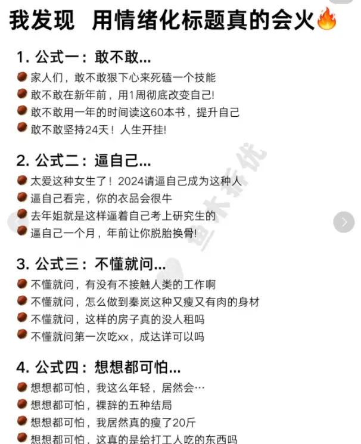

# 爆款标题的底层逻辑：4大爆款因子

在标题里添加这4类爆款因子，标题的点击率将会提升不止10倍。

### 1、情绪因子

做自媒体一定要会借助情绪放大内容，在标题里添加情绪词。

小红书上直播一姐伊能静为什么能后来居上超越董洁？也是因为她擅长共情。

比如她讲“配得感”，她懂我们穷人家的孩子，从小被打压式教育下长大，不敢吃好的，不敢买贵的，不敢大方地谈“美”。她鼓励我们主动追求美好事物，让自己有能力配得上那些物质的东西，单就这一点就能吸引粉丝下单。

我们大部分人都是普通人，没有过硬的专业知识，写出来的内容没有权威和专业性，没人看很正常。但普通人优势在于接地气，如果能在内容里传递普通者的情绪感受，就能共情到大部分读者，吸引他们点击查看内容，这是非常重要的取标题的一个底层思维。

如何在标题里加入情绪因子？

（1）提炼内容传递的情绪

如果是干货类内容，就强调实用性、价值性和稀缺性，强调自己的苦口婆心，就能快速抓住读者的注意力。

比如：“价值百万”、“真心建议”、“少奋斗10年”、”真后悔没早点知道...“、“错过拍大腿”、”xx天花板“等等。

如果是人设或观点类内容，就要带自己强烈的情绪感受，增强共鸣和感染力。

比如：”哭死“、”太好哭了“、”救命“，甚至是一些感叹词“啊啊啊！“、“快冲”等等。

（2）平时注意搜集一些【带有强烈情感共鸣的情绪词】

大量刷爆款文章的标题，记录下来。  
刻意在标题里添加情绪词，对比看效果。

给大家分享一些常用的情绪词：

- 奉劝xx：《奉劝大家千万不要和同事交心》
- 请大数据xx：《请大数据把这篇推荐给正在找工作的家人们》
- 真心建议：《真心建议，打工而已千万别内耗自己》
- 不懂就问：《不懂就问，学霸原来是这样养成的吗？》
- 想想都可怕：《想想都可怕，居然真的有人45天考过研究生》
- 一个很变态，但xxxx：《一个很变态，但能百分百进外企的野路子》
- 救命！我真的会…《救命！我真的发现了爆款标题的秘密》
- 我宣布…《我宣布，这是我今年读到最好的一本书》
- 人生建议：…《人生建议：工作而已，千万不要太“内耗”》
- 手把手/保姆级/胎教级教学《强烈建议这样搭建复盘体系！保姆级教程》
- 被追着问的…《合集！被追着问了八条街的少年感传搭来啦！》
- 后悔没有早点《真后悔没早点看到这本书》  
- …，我变成了…《26岁，我变成了我曾经最想成为的大人》
- 我发现…《我发现厉害的女生都有一个共性》  
- 真的有被惊艳到《真的每次都被她惊艳到~》  
- 听劝！《极简存钱| 听劝！没钱请停止做这20件事》
- 名词+太+形容词... 《<承欢记>真的太让人窒息了》
- xxx的xxx，确定不听一下吗？《巴菲特的智慧精华，确定不听一下吗？》
- 偷偷告诉你xxx：《偷偷告诉你，如何阅读电子书更有效》
- xxx（深度好文）：《底层家庭的囚徒困境（深度好文）》
- xxx，这一刻我xx样了：《44岁著名奥运冠军，被爆生了3个“弱鸡”娃，这一刻我豁然开朗了》

类似这样的情绪化标题在小红书上有很多，大家可以都集中搜集起来。

在标题里添加情绪因子其实不难，你可以想象自己是一个推销员，在努力地吆喝，卖你的产品，该说什么样的话术呢？（用什么样的情绪词快速抓住读者的注意力呢？）

你可能会觉得这样的标题口水化，觉得太low。大可不必这样想，做账号，一切行为围绕结果。当你将这些情绪感受加在标题里时，它就是会撬动更大的流量。

### 2、好奇因子

如果前面的情绪因子是在吆喝，那么好奇因子就是在标题里埋下钩子，吸引读者点击，拉动文章的阅读量。

人天生自带好奇心，只要你的标题里激发了他的好奇心，他不点开看就难受。

3个吸引读者好奇的方式：

（1）是什么（What）

话说一半，藏一半，让读者去猜，吊足胃口。

- 《做到这三件小事，人生少走好多弯路》（读者好奇：这3件让我少走弯路的事是什么？）  
- 《真正的富养， 是给孩子这3种安全感》（读者好奇：这3种是哪三种？）  
- 《陈道明：当你老了，躺在病床上就会明白，晚年靠得住得不是儿女，不是金钱，而是...》（就连我好奇到底是什么）  
- 《孩子最讨厌父母说的5句话，希望你一句也没说过》（到底是哪5句？）

这种What式的标题还可以取很多，如果你想表达的是一个或多个观点、一个或多个反常识的认知，可以试试看。

（2）为什么（Why）

有问题就会有答案，要寻找答案就要不停探索。

当你在标题里埋下一个大家都关心的问题时，好奇它的人就会有探索欲，忍不住地点开。以下是一些Why类型的标题举例：

- 《苏轼：人活着，到底是为了什么》（生命的意义是重大的人生课题，感兴趣的人很多）  
- 《蔡崇信：我为什么敢放弃580万年薪，拿月薪500跟马云创业？》（前后强烈的薪酬反差，是个正常人都想知道为什么）  
- 《年轻人不能为挣钱而活：董明珠为什么老是发出这种惊天言论》（吸引的是对董明珠言论感兴趣的人）  
- 《看了全网窒息的“五万别墅“事件，我终于明白为什么有人一辈子受穷》（“穷”是大家的普遍痛点，应该没有人不想知道吧）

试着在标题里埋下一个大家都感兴趣的问题，问题越普遍，群众越关心，越好。

（3）怎么办？（How）

如果说Why类型是在帮助读者想清楚一些事情，那么How类型，就是在帮读者寻找答案。  
特别是对于一些干货、经验类的文章来说，就特别适合这种How类型的标题。

- 《女人怎样才算嫁得好？》  
- 《长期”精神内耗“的人，该如何放过自己？》  
- 《如何培养一个内心强大的孩子？父母要把这6句话当成口头禅》  
- 《提升能力的6个小方法，送给正在焦虑的你》  
- 《<找不到工作的一年>：人在低谷，如何自我疗愈？》

注意：一个标题制造的好奇效果是因人而异的，有这几类，能够激发更强烈的好奇心。

- （1）反常识、新认知。What类型标题里，加入“秘密”、”冷知识“、“你一定不知道”、“狗血”、“惊掉下巴”等这类名词或形容词，读者的好奇心就会被N倍放大。  
- （2）名人及热点相关的。跟名人相关的八卦或冷知识，大家关心的敏感话题，热搜上的热门话题，这些都是自带流量的关键词。这些关键词和好奇因子会迸发出强烈的化学反应。  
- （3）新奇的、不一样的体验。人是有猎奇心理的，如果你的内容自身是一种鲜为人知的经验或体验，就能勾起读者强烈好奇心的，就没有人不想点进去看。比如《专门帮富豪花钱是种什么样的体验》、《在香港1800W的房子长什么样》等。

好奇心这个爆款因子是取标题常用的技巧，基本适用于所有领域。

### 3、利益因子

有一位老师曾说：做自媒体，就是让用户占便宜，谁让用户占得越多，谁的粉丝黏性就越强。

写公众号也一样。我们提供免费的内容，就是想要吸引读者点击和关注到我们，而关注我们的粉丝多了，我们才能进一步地接广和变现。

读者凭什么关注我们呢？一定是我们的内容有价值，不管是情绪价值、信息价值还是实用价值，这些价值一定要在标题里面展现写出来。在标题里加入利益因子，就是展示我们的内容带来的实际性的利益、价值。

基本上，我们可以展示的有下面几类利益：

（1）金钱/利益诱惑

展示实实在在的金钱刺激，让用户觉得读完就是赚到，读完就捡了大便宜，不读就是亏大了。

- 不花钱xx：《不花一分钱，5个好习惯，让你越睡越美》  
- 赚钱xx：《又稳又多赚，除了银行，还能这样理财》  
- xx的秘密：《关于双十一营销的秘密，全在这里了》

（2）突出“捷径”、“速成”

人的天性是急于求成，追求速成和捷径，在标题里展示“多/快/好/省”这样的捷径，大家就会忍不住想要点击。

- 终极xx：《1个终极方法，帮你找到优势天赋》  
- 几分钟....../x小时......：《手把手教你如何1小时读完1本书》  
省时/省力：《12分钟看完90万字的<三体>》  
- 《如何更有策略地选择工作，让自己少奋斗10年》  
- 《搞钱的底层逻辑，看懂少走10年弯路》  

（3）干货叠加

其实就是简单的清单体，直接将干货直接罗列出来。

- 《让你越活越年轻的8个解压方法，学会受用终生！》  
- 《旺自己最好的方式：早起、运动、读书、冥想、写作》  
- 《做到这3件小事，少走好多弯路》  
- 《转运最好的方式：断舍离》

### 4、恐惧因子

恐惧是人类的底层情绪：如果把毒蛇和木棍放在一起，人们第一个看到的是毒蛇；如果把老虎和猪放在一起，人们第一个看到的是老虎。

人天生对损失、危机敏感，看到交通事故、地震、洪水、被骗、钱财损失、食品安全等负面信息，会生理性地想要点击，这是人的生存本能。

取标题时，我们可以利用人的这种恐惧的情绪，激发读者的危机感。

列举几类常见的恐惧情绪，可加在标题里。

裁员、降薪、失业、找不到工作、经济危机、行业黑幕  
- 《大裁员的前夜》  
- 《外卖行业的黑幕曝光：年轻人，别再吃这些外卖了》  
- 《最近两年失业找不到工作的，大部分都是那些平时没啥交际的人，反而那些很会混的人，工作根本不愁》

想毁掉/废掉/害了，就这样做

- 《想毁掉一个孩子，就反复跟他说这8句话》

千万别/害了/毁了

- 《千万别和任何人熟得太快》

99%的人都错了

- 《延迟满足=自控力？99%的家长都错了》

大坑/骗局/暴雷

- 《这个骗局，为何万余人上当？》

讨厌/反感

- 《成年人最讨厌的聊天方式》  
- 《微信聊天最让人反感的4种行为，希望你一个都没有》

信息差

- 《打破信息差，别再跟着长辈伪科学育娃》

恐惧因子，尤其适合那些负面新闻，与大众认知相反以及本身带有巨大危害性的主题。

以上就是几种比较常见的爆款因子，它其实拿捏的是人性最底层的情绪和欲望。学会这4大类爆款因子，你的标题想不爆都难。

另外，平时我们在刷手机的时候，不要刷过就过了，要去分析一下这些标题为什么会爆，验证它们触动的是哪一类底层情绪。这就是一个培养自媒体网感的过程。

## 二、撰写标题的技巧  

当我们学会了4类爆款因子来做爆款标题之后，还可以学习一些取标题的技巧，为我们的标题增加点击率。

### 1、对比法  
好的对比能形成巨大反差，让读者忍不住想点击进去看。  
- 《你在国外买SKII，老外在中国抢大宝》  
- 《以为嫁给了暖男，婚后才发现是巨婴》    
- 《董宇辉和孟羽童之间，隔了一个王自如》

### 2、对话法  
把读者当作朋友，讲述一件事，吸引他们的注意力。  
- 《“你有钱了不起啊” “了不起”》  
- 《笑死，我被割韭菜了》

### 3、疑问法  
其实疑问法跟好奇因子里的Why差不多：  
- 《那个躲在厕所里吃饭的孩子，后来怎么样了？》  
- 《2023年只剩一个月，你过得怎么样？》  
- 《知乎热门：领导为什么总是提拔不靠谱的人》  
- 《人穷的时候，应该干什么？》

### 4、俗语法  
前半句用耳熟能详的俗语，后半句自己编，最好要押韵。  
- 《朋友一生一起走，谁先脱单谁是狗》  
- 《人生没有白走的路，但是有弯路》

### 5、事实+观点法

当你讲述某个观点时，不可能只讲认知和观点，一定会添加一些案例或者借助一些热点。将标题用“案例/事+观点”形式展示出来，既能吸引读者的注意力，又输出了观点和价值观，是一种非常受读者欢迎的形式。

- 《李佳琦直播翻车上热搜：真正优秀的人，从来不秀优越感》  
- 《雷军2023年最新演讲：别畏难，先干起来再说》

### 6、故事+观点法

跟第5种很类似，只不过这里添加的是案例里面的故事，有画面、有场景、重要细节，读者会产生代入感，天生想要点击进去。  
- 《<哪吒>冲20亿元！导演40岁逆天改命背后：永远去做余生最重要的事》  
- 《陕西夫妻刷短视频，意外发现隐秘潜规则：原来我们早已被围困，却浑然不知》  
- 《”朋友从小就在为高嫁做准备“上热搜：承认别人优秀，到底有多难？》

### 7、激发认同法

标题里如果替用户说出他心中的话，表达他心中想表达的观点，展示他想展示的态度，就会在极大程度上激发用户的认同感。  
- 《我这么努力，就是为了有说”不“的权利》  
- 《永远不要叫醒一个低认知的人》  
- 《一个人真正的强大：一切与我无关》  
- 《一个人最大的才华：人品》  

## 三、标题里的关键词
每一个标题都由很多元素构成，每一个元素都是一个个关键词、词组。在标题里我们可以加入这4种关键词：

### 1、热点关键词

做自媒体平台，一定要学会借势，热点事件和热点话题，就是我们要借助的势能，将热点加在标题里，点击率会大大提升。

常见的热点关键词包括：热门事件、热门电影、热门综艺、热门电视剧、明星新闻、社会新闻等等。  
- 《福建女子“未婚先孕”，22万彩礼“闹崩”事件：姑娘，快逃！》  
- 《请妈妈给自己做回早饭后，湖南9岁男孩，在上学路上跳楼身亡》

### 2、痛点关键词

痛点，就是大家普遍存在的毛病或急需解决的问题。  
痛点关键词包括：穷、丑、矮、胖、失恋、离婚、出轨、毁掉、失败等等。  
- 《穷人的隐性负债，若不清算，一辈子都还不完》  
- 《一个中年人的”最后一次失业“》

### 3、数字关键词

人天生对数字敏感，在标题里添加数字辨识度高、可以丰富细节，增加看点。  
这里的数字最好是阿拉伯数字，几种常见的数字有：年龄、金钱相关以及说明程度的数字。  
- 《微信这13个功能，检验一个人到底爱不爱你》   
- 《长期缺钱的人，都有4个穷人思维，藏都藏不住》  
- 《44岁奥运冠军被曝生了3个“弱鸡娃”，却意外缓解了无数人的焦虑》  

### 4、超级符号关键词  
超级符号词，就是大家耳熟能详的词，包括几大类：  
- 名人：包括明星、网红、企业家、热门人物、运动员等。  
- 头衔：老板、创始人、产品经理、运营等大家熟悉的职称。  
- 机构：人民日报、央视、腾讯、小米、格力等知名机构。